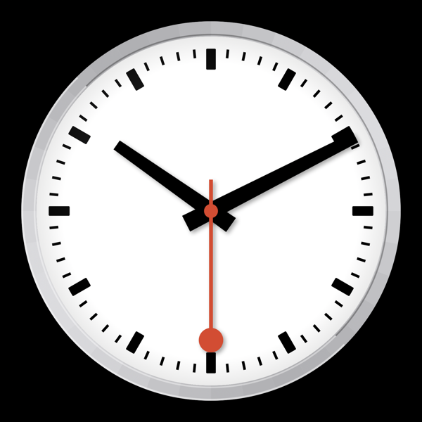

# Swiss Railway Clock Screensaver

A macOS screensaver inspired by the iconic Swiss Federal Railways (SBB) clock design, featuring the distinctive red second hand with its circular tip.



## Features

- Authentic Swiss railway clock design
- Brushed aluminum bezel effect
- Smooth 30 FPS animation
- Optimized for low CPU/GPU usage during extended idle periods
- Supports both Intel and Apple Silicon Macs

## Installation

1. Download the appropriate DMG for your Mac from the [Releases](https://github.com/davenicoll/swiss-railway-clock-screensaver/releases) page:
   - `SwissRailwayClock-1.0-AppleSilicon.dmg` for M1/M2/M3 Macs
   - `SwissRailwayClock-1.0-Intel.dmg` for Intel Macs

2. Open the DMG and copy `SwissRailwayClock.saver` to `~/Library/Screen Savers/`

3. Open **System Settings > Screen Saver** and select "Swiss Railway Clock"

## Security Note

This screensaver is self-signed. On first run, macOS may block it. To allow:

1. Go to **System Settings > Privacy & Security**
2. Scroll down to find the message about SwissRailwayClock being blocked
3. Click "Open Anyway"

## Building from Source

```bash
git clone https://github.com/davenicoll/swiss-railway-clock-screensaver.git
cd swiss-railway-clock-screensaver
xcodebuild -project SwissRailwayClock.xcodeproj -scheme SwissRailwayClock -configuration Release build
```

The built screensaver will be in `~/Library/Developer/Xcode/DerivedData/SwissRailwayClock-*/Build/Products/Release/`

## License

MIT
